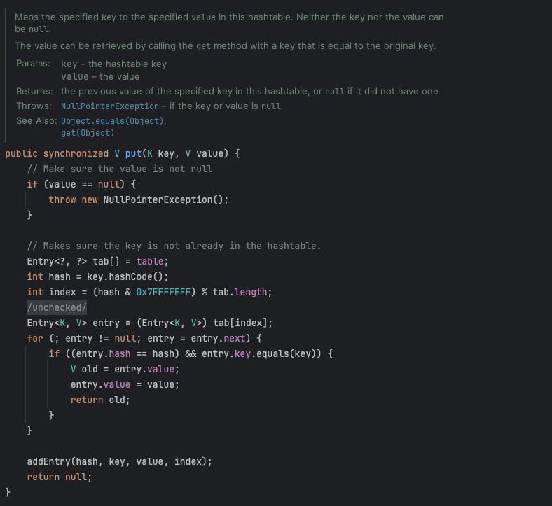
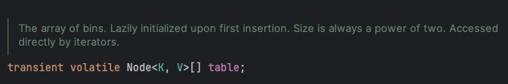

# ConcurrentHashMap은 어떻게 동시성을 보장할까?

개발을 하다보면 특정 key에 대한 value를 저장하고 관리해야할 필요가 많다.

Java에서는 Key, Value 형태로 데이터를 관리하는 자료구조로 `Hash Table` 과 `HashMap`을 두고 있다.

HashTable은 JDK 1.0에 등장했고 JDK 1.2에서 컬렉션 프레임워크가 도입되면서 HashMap이 등장했는데 컬렉션 프레임워크 Map의 기본 구현체인 `HashMap` 을 일반적으로 많이 사용한다.

## Thread Safe하지 않은 HashMap

Java는 멀티 스레드를 지원하는 언어이다. 스프링 역시 요청 당 각각의 스레드를 활용해 요청을 처리하는데 이런 환경에서 동기화를 진행하지 않는 HashMap은 Thread Safe 하지 않다.

### **Thread Safe란?**

여러 개의 스레드가 동시에 객체에 접근하더라도 객체의 상태가 꼬이지 않도록 안전하게 설계된 상태로 공유 자원에 대한 일관성을 보장하는 경우 Thread Safe하다고 표현한다.

자세한 개념은 해당 책을 읽어보길 추천

[product.kyobobook.co.kr](https://product.kyobobook.co.kr/detail/S000000935083)

### Hash Table은 Thread Safe

`HashMap`과는 다르게 Hash Table은 Thread Safe하다.

내부적으로 `synchronized` 를 활용해 Thread Safe를 보장하는데, 버킷 전체에 대한 락을 활용한다는 점, 읽기 연산에서도 락을 통해 동기화를 보장한다는 점에서 성능상 문제가 있다.



HashTable put 내부 구현

그렇다면, HashTable은 성능에 대한 문제가 있고, HashMap은 Thread Safe하지 않는데 멀티 스레드 환경에선 어떤 자료구조를 사용해야할까?자

Java에선 여러 스레드의 요청 간에 Thread Safe한 처리를 위해선 동기화를 위한 `동시성 컬렉션`인`ConcurrentHashMap`을 지원한다.

## ConcurrentHashMap

`ConcurrentHashMap`은 Java에서 멀티스레드 환경에서 안전하게 Map을 사용할 수 있도록 설계된 동시성 컬렉션 클래스로 HashMap과 유사하게 동작하면서 성능 저하를 최소화한다.

그렇다면 ConcurrentHashMap은 어떻게 동기화를 보장하고, 어떻게 동기화를 보장하면서 성능을 보장할까?

### 1. 쓰기 연산 - 버킷 단위의 Lock (Fine-Grained Locking)

ConcurrentHashMap은 버킷 전체에 대한 동기화를 진행하는 것이 아닌 **버킷 단위로 동기화**를 진행한다.

```java
int hash = hash(key);      // key.hashCode() 가공
int index = hash % table.length; // 버킷 인덱스 결정
```

hashmap은 기본적으로 16개의 버킷을 두고 위와 같은 방식으로 버킷을 찾는다. 이 때 모든 버킷에 대한 락을 거는 것이 아닌 본인이 데이터를 추가할 버킷에 대해서만 synchronized를 걸어 동기화를 진행한다. 다른 스레드에서 다른 버킷에 접근이 가능하게 설계되어있어 성능적인 의점을 얻을 수 있다.

아래는 ConcurrentHashMap의 put과 putIfAbsent의 구현의 일부이다. HashTable과 다르게 메서드 전체에 synchronized를 걸지 않고 조건에 따라 분기를 많이 진행한다.

```java
final V putVal(K key, V value, boolean onlyIfAbsent) {
        if (key == null || value == null) throw new NullPointerException();
        int hash = spread(key.hashCode());
        int binCount = 0;
        for (Node<K,V>[] tab = table;;) {
            Node<K,V> f; int n, i, fh; K fk; V fv;
            if (tab == null || (n = tab.length) == 0)
                tab = initTable();
            else if ((f = tabAt(tab, i = (n - 1) & hash)) == null) {
                if (casTabAt(tab, i, null, new Node<K,V>(hash, key, value)))
                    break;                   // no lock when adding to empty bin
            }
            else if ((fh = f.hash) == MOVED)
                tab = helpTransfer(tab, f);
            else if (onlyIfAbsent // check first node without acquiring lock
                     && fh == hash
                     && ((fk = f.key) == key || (fk != null && key.equals(fk)))
                     && (fv = f.val) != null)
                return fv;
            else { // 
                V oldVal = null;
                synchronized (f) { // 동기화 진행
                // 이후 구현 ..
}
```

1. 초기 테이블이 생성되지 않은 경우 (첫 put 요청) - table을 초기화한다.
2. 버킷이 비어있다면, 락을 사용하지 않고 **CAS**로 새 노드를 삽입한다.
    - Compare And Set (CAS)란?
        
        특정 자원에 대해서 기존에 읽었던 값과 현재 읽는 값을 비교 후 이 값이 같을 경우에만 새로운 값을 쓰는 방식
        
3. 버킷의 사이즈를 조정 중이라면 해당 작업을 도와준다. ~~(여러 스레드의 협업..? ㅋㅋㅋ)~~
4. 키가 이미 존재하고 덮어쓰지 않는 경우 (`putIfAbsent`의 경우)
5. 그 외의 경우 put을 할 때에는 `synchronized` 로 동기화를 걸고 진행

결론적으론, 쓰기 연산에서 버킷 단위로 구분을 하고 덮어쓰기를 진행해야하는 경우에만 동기화를 통해 성능까지 보장한다.

### 2. 읽기 요청 - Lock 없이 volatile

ConcurrentHashMap은 읽기 과정에서는 락을 사용하지 않는다. 대신 **volatile read**와 **불변 구조**를 통해 Thread Safe를 보장한다.

**volatile read**



우선 위와 같이 값을 저장하는 table 변수를 `volatile` 로 선언한다. volatile 변수를 사용하면 여러 스레드가 공유하는 변수에 CPU 캐시를 이용하지 않고 값을 메인 메모리에서 직접 읽어온다.

따라서, 값을 읽는 순간 이전에 일어난 모든 put연산에 대한 결과가 메모리에 반영이 되어있어 이 시점까지의 모든 결과를 볼 수 있게 된다.

**불변 구조**

`ConcurrentHashMap`의 `Node` 는 아래와 같은 필드를 컨트롤 하면서 불변성을 만족한다.

- hash, key :  final 로 초기화된다.
- val : volatile 로 선언되어 값이 변경되어도 바로 최신 값을 조회할 수 있다.

이러한 구조로 Thread-Safe를 보장하며 읽기 과정에서 락 획득을 하는 대기 과정을 줄여 성능 문제 또한 줄이게 된다.

## 결론

ConcurrentHashMap은 동기화를 보장한다는 것을 알고는 있었지만 막상 어떻게 동기화를 보장하느냐는 질문을 받으면 구체적으로 동작 원리를 알지는 못해 답하기 어려웠는데 이 기회에 구체적인 원리를 알 수 있었다.

또한, 백엔드 개발자에게 Thread-Safe한 설계는 꽤 중요한데 개념적으로만 알고 있고 의도해서 구현해본 경험은 없다. 이번 공부를 통해 자바 진영에서 동기화를 어떻게 해결하려는지 알 수 있었기에 이를 의식하면서 개발을 해봐야겠다.