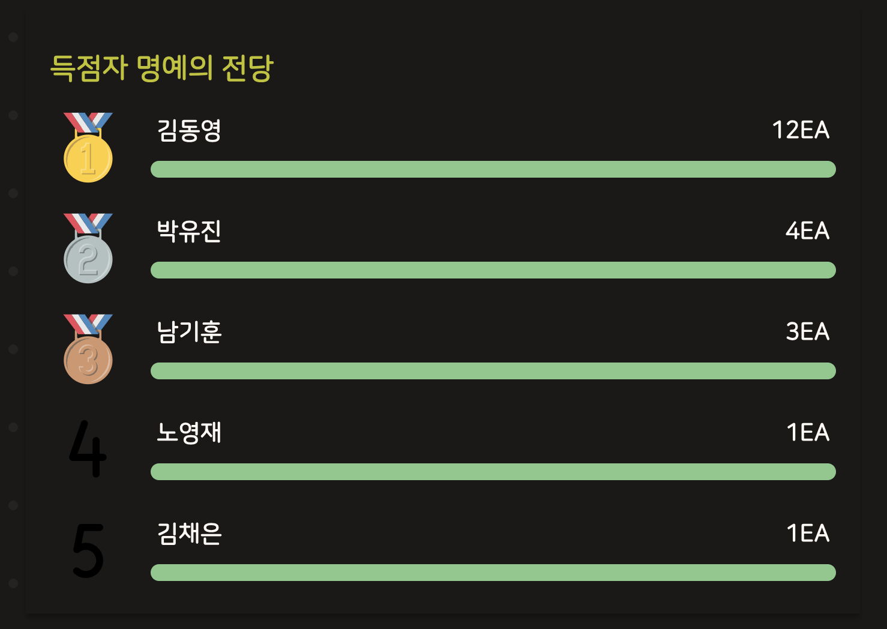
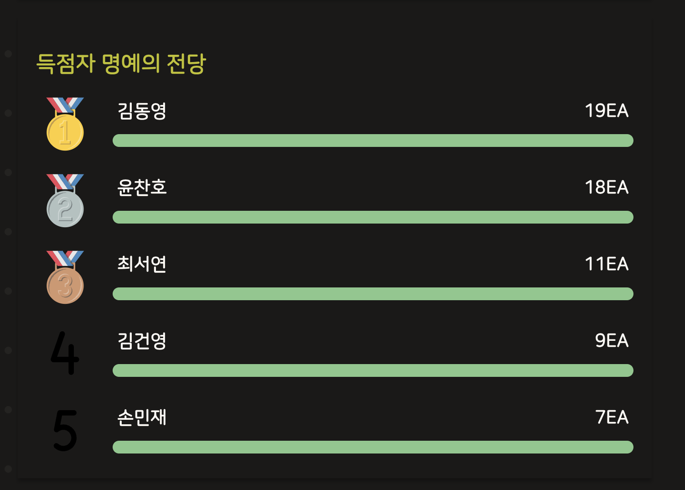
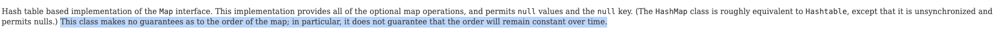
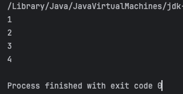
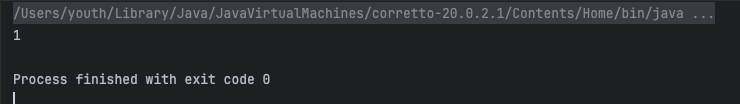
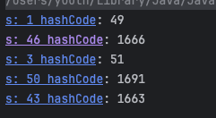

# 문제 및 풀이 신호 전송 비동기처리

선착순 퀴즈 풀이 프로젝트는 23년 10월 시작된 이후 매 주 프로젝트 회의를 진행하고 있다.

아무래도 매주 금요일 ‘코테이토’ 정규 세션에서 활용을 하고, 회의를 주말에 진행하기 때문에 세션 진행간 발생했던 이슈 또는 이상한 점을 회의 초반에 공유하고 시작한다.

### 문제

이 중 ‘특정 인원의 득점률이 과하게 높은 것 같다.’라는 이야기가 나왔다.

실제로 이를 파악하기 위해 통계 페이지를 확인한 결과 현재 10기 CS교육을 진행하다보면 특정 인원의 득점률이 과하게 높다는걸 볼 수 있다.



10기 기록 (12월 초 기준, 총 30문제 중)



9기 기록

이는 9기에도 비슷하게 발생했던 이슈인데, 당시에는 쏠리지는 않지만 비슷하게 상위권 득점자를 보면 자주 등장하는 이름들이 있다.

나름 광클 방지, 동시성 처리 등 치트키라고 불릴만 한 것들은 방지해뒀는데 개발진들이 모르는 다른 방법이 있는걸까? 라는 생각이 들어 우선 해당 인원에게 치트키가 있는지 물어봤다.

상위권 득점자에게 물어본 결과 특별한 꼼수는 없고 ‘풀이 허용’ 표시인 전구가 뜰 때 가장 빠르게 응답을 했을 뿐이라는 답이 왔다.

특별한 꼼수가 없는 것 같아보이는데 단순히 운 또는 노력일까? 아니면 정말 **가장 먼저 신호를 받을까?**

### 다른 인원보다 먼저 신호를 받을까?

네트워크 등의 요인도 존재하겠지만, 서버 로직 상으로 문제 전송이 순차적으로 이루어지고 순서가 존재한다면 이런 문제가 발생하지 않을까? 하는 생각이 들었다.

현재 소켓이 연결된 세션에 신호를 보내는 방식을 확인해보니 아래와 같이 for문이 돌고 있다.

```java
    public void startQuiz(Long quizId) {
        QuizStartResponse response = QuizStartResponse.builder()
                .quizId(quizId)
                .command(START_COMMAND)
                .build();

        log.info("[문제 {} 풀이 허용]", quizId);
        log.info("[연결된 사용자 : {}]", CLIENTS.keySet());
        for (WebSocketSession clientSession : CLIENTS.values()) {
            sendMessage(clientSession, response);
        }
        log.info("[풀이 신호 전송 후 사용자 : {}]", CLIENTS.keySet());
    }

    private void sendMessage(WebSocketSession session, Object sendValue) {
        try {
            String json = objectMapper.writeValueAsString(sendValue);
            TextMessage responseMessage = new TextMessage(json);
            session.sendMessage(responseMessage);
        } catch (IOException e) {
            throw new AppException(ErrorCode.WEBSOCKET_SEND_EXCEPTION);
        }
    }
```

for 문으로 돌면 결국 순차적으로 발송이 되는 것 아닐까? 그러면 진짜로 조금이라도 신호를 먼저 받기 때문에 문제 풀이에 유리하지 않을까? 라는 의문이 들었다.

로컬에서 테스트 했을 때의 결과는 밀리초 단위로 동일했다고 하지만 네트워크 상황이 반영된 실제 운영환경에선 다를 수 있겠다 싶었다.

이는 분명 모두에게 공정하게 신호가 전송되어야하는데 순차발송으로 인해 부원간의 풀이 허용 신호를 전송 받는게 차이가 난다면 공정하지 않은 상황이었다.

### 순차발송이라면 어떤 순서로?

순차적으로 발송을 한다면, 네트워크가 막히지 않고 서버에 문제가 없다면 밀리초 단위의 차이가 나는 상황인데 크게 문제 없지 않을까?

오히려, 먼저 교육에 참여해 세션을 연결한 인원이 신호를 먼저 받게 된다면 적극적인 인원에게 약간의 어드밴티지를 준다는 측면에서 허용될 수 있다는 의견이 나왔다.

우선, 어떤 순서로 부원들이 내용을 전달 받을지 확인해보기 위해 세션 관리 방식을 확인해봤다.

```java
private static final ConcurrentHashMap<String, WebSocketSession> CLIENTS = new ConcurrentHashMap<>();
```

소켓 세션 관리는 위와 같이 ConcurrentHashMap<`memberId`, `세션`>으로 관리하고 있다.

따라서 순서를 보장하는 컬렉션인 아닌 HashMap 이기에 먼저 교육에 참석( = 세션 연결)을 했다고 해서 순서가 보장되진 않는다.

Oracle Java 8 Doc 확인 결과 `keySet()` 을 순차적으로 꺼낼 때 명확한 순서는 정해져있지 않다고 한다.



https://docs.oracle.com/javase/8/docs/api/java/util/HashMap.html

순서가 보장되지 않는다가 결론이지만 테스트를 한번 해본 결과 10,000이상을 돌려봤다.

### ConcurrentHashMap의 `keySet()`을 for 문으로 돌리면 어떤 순서로 나올까?

```java
    public static void main(String[] args) throws Exception {
        ConcurrentHashMap<String, String> map = new ConcurrentHashMap<>();

        map.put("4", "4");
        map.put("1", "1");
        map.put("3", "3");
        map.put("2", "2");

        for (String value : map.values()) {
            System.out.println(value);
        }
    }
```



당연하게도 Map에 먼저 들어갔다고 `keySet()` 를 호출했을때 먼저 반환되지 않는다.

이를 Integer.MAX_VALUE 번 반복 후 순서 리스트를 Set에 저장했다.

```java
    public static void main(String[] args) {
        Set<String> results = new HashSet<>();

        for (int i = 0; i < Integer.MAX_VALUE; i++) {
            results.add(foo());
        }

        System.out.println(results.size());
    }

    private static String foo() {
        ConcurrentHashMap<String, Integer> map = new ConcurrentHashMap<>();

				map.put("1", "가나다");
        map.put("3", "가나다");
        map.put("43", "가나다");
        map.put("46", "가나다");
        map.put("50", "가나다");

        List<String> keys = new ArrayList<>();

        for (String s : map.keySet()) {
            keys.add(s);
        }

        return keys.toString();
    }
```

하지만 Set size는 1이었다.



호출되는 순서가 오름차순은 아니었고, 혹시나 싶어 해시코드를 확인했지만 해시코드 값도 중요한 지표는 아니었다.



아마 해시 버킷을 순차적으로 돌며 있는 키를 반환하는데, 이 때 Resizing과 Rehasing이 일어나면서 해시 버킷이 바뀌고 이에 따라 순서를 보장할 수 없다는 이야기가 아닐까 싶다.

HashMap에 대한 자세한 이야기는 따로 정리하도록 하겠다.

아무튼, 순차적인 전송 방식은 키로 사용하고 있는 memberId에 따라서 특정인원이 **조금이라도 신호 전송을 먼저 받을 수 있다.**

우리는 비록 40여명만 사용하는 서비스지만 이 순차적인 방법은 확실히 공정하지 않다고 여겼고 최대한 동시에 부원들에게 문제를 전송하는 방법을 선택했다.

또한, 실제로 키는 버킷으로 관리되기에 그냥 랜덤하다.

(사실 그렇다고 하더라도 최대한 동시에 전송하는 것이 유리하다.)

### 멀티스레드와 비동기 활용해 발송하자 : 해결

`@Async`와 `CompletableFuture<Void>` 

https://mangkyu.tistory.com/263

이를 해결하기 위해 하나의 스레드에서의 순차 전송이 아닌, 여러개의 스레드를 활용해서 동시에 발송하면 어떨까?

기존 방식의 문제는 동기적인 순차발송이었다. 하나의 신호 전송 완료를 기다리고 다음 신호 전송을 하는 방식에서 오는 시간 차이 문제였다.

Java에는 `@Async` 를 활용해 스레드 풀에서 비동기로 작업을 처리할 수 있다.

단, `@Async` 는 AOP가 적용되어 Spring Context에 등록된 Bean이 호출되기에 아래 2가지가 불가능하다.

1. private 메서드 사용 불가 (프록시)
2. 자가 호출 불가능

따라서, 소켓에 값을 전송하는 SocketSender 클래스를 아래와 같이 추가하자.

```java
@Component
@RequiredArgsConstructor
public class SocketSender {

    private final ObjectMapper objectMapper;

    @Async("quizSendThreadPoolExecutor")
    public CompletableFuture<Void> sendMessage(WebSocketSession session, Object sendValue) {
        try {
            String json = objectMapper.writeValueAsString(sendValue);
            TextMessage responseMessage = new TextMessage(json);
            session.sendMessage(responseMessage);
            return CompletableFuture.completedFuture(null);
        } catch (IOException e) {
            throw new AppException(ErrorCode.WEBSOCKET_SEND_EXCEPTION);
        }
    }
}

// Config.java
    @Bean("quizSendThreadPoolExecutor")
    public Executor quizSendThreadPoolExecutor() {
        ThreadPoolTaskExecutor taskExecutor = new ThreadPoolTaskExecutor();
        taskExecutor.setCorePoolSize(20);
        taskExecutor.setMaxPoolSize(100);
        taskExecutor.setQueueCapacity(10000);
        taskExecutor.setThreadNamePrefix("quiz-send-thread-");
        taskExecutor.initialize();
        return taskExecutor;
    }
```

부원 수가 40명 내외이므로 코어 스레드 풀을 20개로 설정한다.

```java
    public void startQuiz(Long quizId) {
        QuizStartResponse response = QuizStartResponse.builder()
                .quizId(quizId)
                .command(START_COMMAND)
                .build();

        KeySetView<String, WebSocketSession> beforeUsers = CLIENTS.keySet();
        Collection<CompletableFuture<Void>> tasks = new ArrayList<>();
        for (WebSocketSession clientSession : CLIENTS.values()) {
            tasks.add(socketSender.sendMessage(clientSession, response));
        }
        CompletableFuture.allOf(tasks.toArray(new CompletableFuture[0])).join();

        logConnectionFailedUser(beforeUsers, CLIENTS.keySet());
    }
```

이후, `CompletableFuture` 클래스의 `allOf` 활용해 기존 실행하는 작업이 모두 종료될 때까지 기다린 후 결과를 얻을 수 있다.

이렇게 되면 하나의 전송이 끝나고 다음 문제를 전송하는 동기적인 방식에서 오는 전송 시간 차이를 줄일 수 있다.

### 결론

**1. 로컬에서의 테스트 결과를 100% 신뢰하지말자**

우선, 해당 순차 발송은 1년전 웹소켓 코드리뷰 과정에서 ‘순차 발송’은 문제가 있는 것 아닌가요? 라는 의문이 이미 제기 되었던 건이다.

다만, 당시에 구현이 앞서서 넘어간 부분과 ‘로컬’에서 세션을 연결해서 테스트 했을 때 밀리초 단위에 차이가 없다는 답으로 해당 건을 넘어간 것이 얼마나 우매한 생각이었는지 다시 반성하게 된다.

**2. 운영환경과 동일한 환경 세팅의 어려움**

해당 문제가 진짜 ‘문제’인지 확인하기 위해 테스트 환경 세팅을 하는 것이 너무 어려웠다. 인증 후 여러 웹소켓 세션을 연결해야하고, 실제 운영 환경과 동일한 네트워크 상황 세팅을 하는 것도.. 테스트 케이스를 분류하기가 어려웠다.

어떻게 가장 유사하게 세팅을 하고 로직을 확인할 수 있을까에 대한 고민이 많이 된다.

이를 위해 적절한 로깅과 메트릭을 확보할 수 있었다면 이런 부가적인 실험에 쓰이는 시간을 줄일 수 있었을 것 같다. 실제 사용자를 대상으로 서비스를 기획하고 개발, 유지보수하고 있는만큼 모니터링과 메트릭 수집 준비가 필요할 것 같다.

개인적으론 이 기회에 비동기와 Map에 대해서 공부할 수 있던 기회였다. 개발하면서 단순 돌아가는 것보단 동작 원리 및 로우 레벨에 조금 더 이해하고 넘어가는 경험을 더 해봐야겠다.

https://mangkyu.tistory.com/425