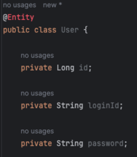

7개월 전 작년 9월, 앞으로의 진로를 개발자, 그중에서도 백엔드로 정하면서 앞만 보고 계속 달려왔다.

그러던 중 코테이토에 들어와 지금 '어떠한 개발자가 될 것인가'에 대한 주제로 글을 써 보며 그간 걸어온 길을 멈춰서 돌아보고, 재정비할 수 있는 좋은 기회를 갖게 되어 정말 다행이라 생각한다!

7개월 간 공부하고 개발하며 '학습'과 '협업'에서 중요하게 느껴지는 것들이 있었고, 이에 따라 어떤 개발자가 되고 싶은지 간략하게 정리해 보았다. 6개월 후에 같은 주제로 다시 글을 쓸 것인데, 지금의 내 생각과 비교해 보는 것도 재밌을 거 같다!

### **학습**

아래 일화는 '학습'에 관하여 쪽팔림? 을 무릅쓰고 올리는 일화인데, 사실 이미 코테이토 면접에서 언급했던 일이기에..

작년 9월~12월까지 교내 GDSC에서 백엔드 강의를 들으며 Spring과 Jpa를 공부한 후,

전공수업인 데이터베이스의 기말과제로 테이블 4개, 화면 10개 정도로 구성된 간단한 프로젝트를 제작했다.

완성하는 것 자체는 어려운 일이 아니었고, 자신감이 붙은 나는 곧바로 새로운 프로젝트를 만들기 위해 코드를 작성했다.

그런데, 아래 사진처럼 컴파일이 되지 않는 현상이 발생했다.

Jpa관련된 의존성을 추가해두지 않았기 때문인데, 중요한 점은 의존성 문제가 아니라, 내가 이 사실을 몰랐다는 것이 Jpa가 객체를 어떻게 관리하는지 모르는 것이고, 따라서 Jpa를 왜 쓰는지도 전혀 모르고 사용한다는 걸 보여준다는 것이다.

이를 깨달은 후, 당연하게 사용하던 것들에 항상 의문을 가지고 왜 사용하는지 생각해 보고, 더 나아가 작동 원리를 깊게 파보는 습관을 들이려고 노력하고 있다. 어렵지만, 이보다 더 빨리 성장하는 방법은 없다고 생각한다.

### **협업**

'협업'에 대한 생각은 팀 프로젝트를 처음 진행한 순간부터 농담이 아니라 거의 매일 생각하는 것 같다.

요즘 머릿속에 생각이 드는 협업을 잘하는 개발자는 '회색지대'의 일을 잘 처리하는 개발자라고 생각한다.

친구, 동기들과 팀 프로젝트를 진행할 때나, 인턴을 하면서 다른 팀원들과 협업을 할 때나, 서로가 담당하기 귀찮거나 서로의 의견이 대립되는 부분이 존재하기 마련이다. 이러한 회색지대의 일이 반복되면 팀 전체의 생산성이 줄어들게 된다. 지금 당장은 내가 손해 보는 것 같아도, 먼저 나서서 이러한 일들을 처리한다면, 팀적인 관점에서 바라보면 오히려 더 도움이 되는 경우가 대부분이라고 생각한다.

결론은, **학습은 수직적으로, 협업은 수평적으로** 하는 개발자가 되려고 한다.
기술에 대한 학습은 바닥이 보일 때까지 깊이, 다른 팀원들과 협업은 내가 먼저 양 옆의 남는 일을 정리하며 진행한다면, 비약적인 성장을 경험하고 똑똑한 개발자로 성장할 수 있을 것이라 생각한다.