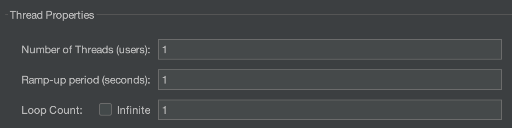
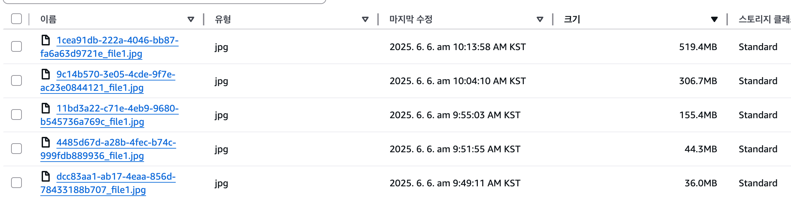
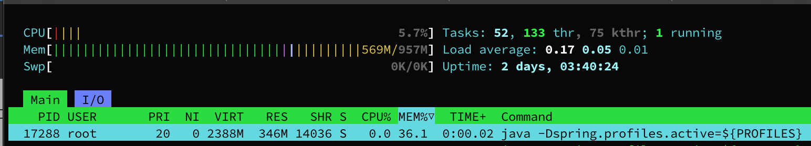
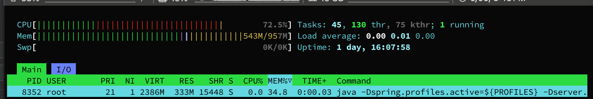
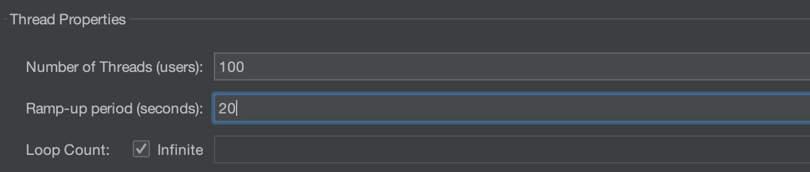
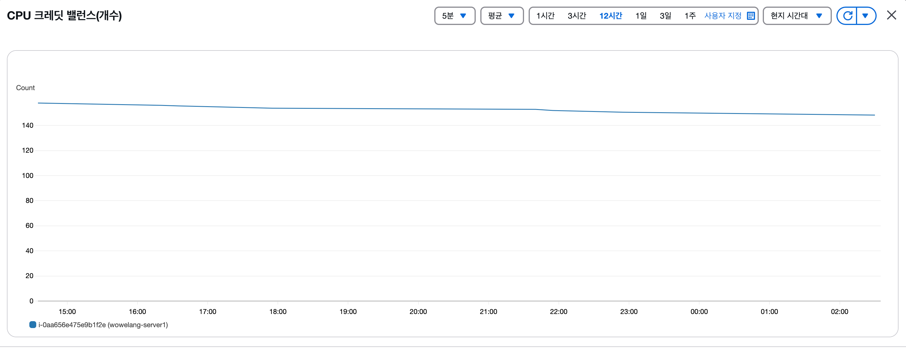
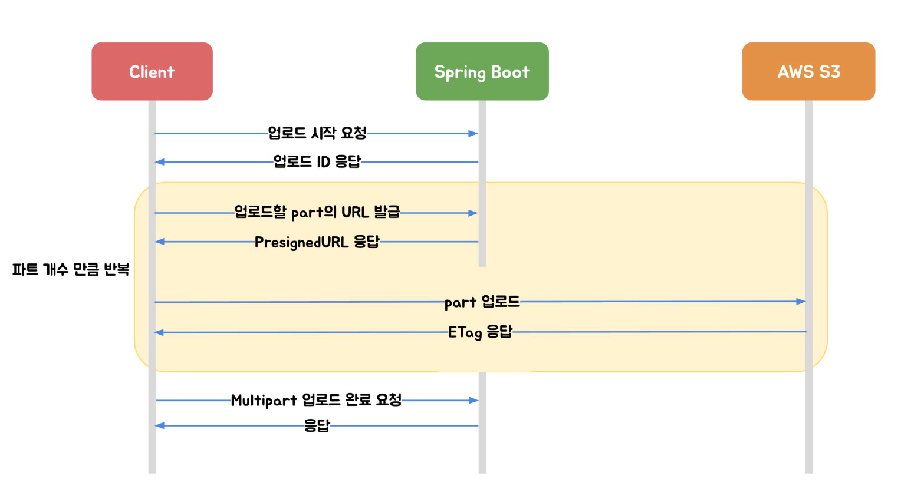
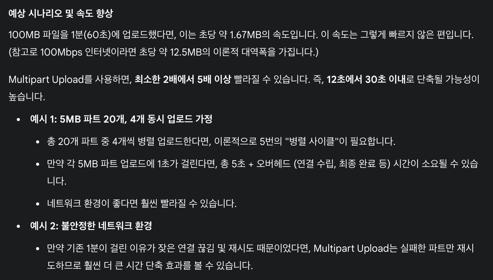

와이랭 프로젝트에서는 사용자가 커뮤니티 게시글을 작성할 때, 이미지를 첨부할 수 있도록 구현했다. 두 가지 방법 중 선택을 해야 했는데,

1. 사용자가 작성한 텍스트와 첨부한 이미지를 업로드 버튼 클릭 시 한 번에 서버로 전송
-> 텍스트와 이미지의 메타데이터는 DB에 저장, 이미지는 S3로 전송
이미지는 첨부하는 즉시 서버 -> S3로 전송,
2. 업로드 버튼 클릭 시 작성한 텍스트와 업로드가 확정된 이미지의 메타데이터를 서버로 전송
-> 실제 게시글에 업로드되지 않은 이미지들은 스케줄러가 주기적으로 S3에서 삭제


1번은 개발자 입장에서 편한 방법이다.

개발자는 작성 도중 취소된 이미지들을 관리할 필요가 없다. 

사용자가 업로드 버튼을 누르기 전까지는 아무것도 서버로 전송되지 않는다.

최종 데이터만 저장되기 때문에 불필요한 데이터 정리 작업을 따로 하지 않아도 된다.

2번은 사용자 입장에서 편한 방법이다.

사용자가 이미지 업로드 유무를 게시글 작성 도중에 즉시 확인할 수 있다.

사용자는 게시글 작성 도중 네트워크 오류등으로 작성 내용이 손실되어도 업로드한 이미지의 key를 갖고 있기에 텍스트만 다시 쓰면 된다.

사용자 입장에서 편한 서비스를 만드는 것이 중요하기에, 2번을 선택했다.


또한 추후 사용자가 여러 매칭일지 파일들을 업로드하는 기능도 제공해야 하기에, 용량이 큰 파일을 업로드해야 하는 요구사항도 있었다.


이런 요구사항들과 사용가능한 서버 자원(ec2인스턴스의 t2.micro)을 고려해 업로드 방식으로 Stream업로드 방식을 선택했다.


Stream업로드 방식은 HttpServletRequest의 InputStream을 이용하여 S3에 파일을 다이렉트로 전송하는 방식이다.

업로드할 이미지의 바이너리 전체가 서버의 힙 메모리를 차지하지 않아 서버의 리소스를 거의 사용하지 않는다는 장점이 있고, 이를 최대한 활용하기 위해 Stream업로드 방식을 선택했다.


실제 서버의 리소스에 얼마나 부담이 가는지 살펴보기 위해 jmeter와 htop 명령어로 테스트를 진행했다.

postman runner를 사용해서 부하테스트를 진행하려 했는데, runner에서는 여러 스레드에서 이미지를 바이너리로 업로드하는 것이 불가능해 jmeter를 사용하기로 했다.


테스트 전 nginx의 configuration파일에서 다음과 같은 설정을 해주었다.
`client_max_body_size 1000M`

## 1. Stream업로드 시 단일 스레드 (1명의 유저)에서 이미지 크기에 따른 업로드



36, 44mb  업로드 문제없음 - 메모리 변화 거의 없음 - 20초 걸림

165mb 업로드 문제없음 - 메모리 변화 거의 없음 - 1분 30초 걸림

300mb 업로드 문제없음 - 메모리 변화 거의 없음 - 3분 걸림

519mb 업로드 문제없음 - 메모리 변화 거의 없음 - 4분 50초 걸림




평상시의 메모리 사용량


519mb이미지를 올릴때 메모리 사용량

이미지가 업로드될 때 inputStream 버퍼 처리 과정에서 cpu사용량이 급격히 증가하는 상황을 제외하면 메모리 사용량에는 변화가 없는 것을 볼 수 있다.

원래는 JVM 힙 메모리 사용량을 보여주는 것이 맞는데, htop명령어 캡쳐본만 저장이 되었다.

jcmd <PID> GC.heap_info 명령어를 통해 힙 메모리 사용량을 확인할 수 있다.

## 2. Stream업로드 시 다수의 스레드 (여러 명의 유저)에서 이미지 용량에 따른 업로드


100명의 가상 유저로 부하를 세게 주려고 했다. 업로드하는 이미지의 크기는 6MB.


초반 5분은 jmeter 자체의 병목현상으로 인해 업로드가 지연되었지만, 그 후 차례로 200개 정도의 이미지가 S3로 끊김 없이 잘 업로드되었다.

이와 같은 테스트를 5~10MB 정도 크기의 이미지로 다수 진행한 후 CPU크레딧을 많이 잡아먹은 것이 아닐까 하고 체크를 했는데, 예상과는 다르게 cpu 크레딧 소모가 거의 없는 것을 확인했다.


하루종일 테스트를 했는데도 소폭 감소했다. 생각보다 t2.micro의 성능이 좋은것 같다.

따라서 이미지 업로드에서는 업로드 용량 제한을 걸어두고 Stream업로드를 사용해도 괜찮을 것 같다는 판단이 들었다.


## 3. 대용량 파일 업로드
   문제는 대용량의 파일을 업로드하는 과정에 있었는데, 이미지 업로드만큼 동시 다발적인 업로드 요청은 없을 것으로 예상되지만, 파일 하나하나의 용량이 무거울 것이기에 Stream업로드 방식을 사용한다면 업로드 시간이 무진장 길어지는 문제를 해결해야 했다.

30MB를 넘어가면 20초, 100MB부터는 1분이 훨씬 넘게 걸리고, 다른 처리할 일이 많은 서버에서 몇 분간 파일 업로드와 관련한 I/O를 처리하는 것이 큰 리소스 낭비라고 느껴졌다.

### - 해결 방안 -
  aws에서는 S3에 대용량의 파일을 업로드할 때, Multipart Upload를 진행하는 것을 권장한다.

이는 대용량 파일을 여러 개의 작은 파트로 분할해 업로드하는 방식이다.

Stream업로드와 가장 차별화되는 점이 있다면, Multipart Upload는 쪼개진 파일들을 병렬적으로 업로드해 업로드 소요 시간을 획기적으로 단축할 수 있는 점이라고 생각한다.

또한 Stream업로드는 중간에 업로드 실패 시 처음부터 다시 업로드해야 하지만, Multipart Upload는 실패한 파트만 재시도하면 된다는 장점도 있다.


aws에서 제공하는 또 다른 업로드 방법으로는, Pre-Signed URL 방식이 있다.

이는 aws 자격 credential이 없어도 제한된 시간 내에 S3에 파일을 업로드하거나, 읽어올 수 있는 권한을 허용하는 URL로, 주로 서버가 url을 생성해 클라이언트에게 제공하고, 클라이언트는 이를 사용해 S3와 직접 통신한다.


여러 해결사례들을 참조해 보니 Multipart Upload방법에 Pre-Signed URL방식을 결합하는 방법이 효율적임을 알게 되어 적용해 보았다.


큰 구조는 그림과 같다

```
// 서버 내부 작업
String key = "tmp/" + uuid + "_" + filename + extension;

InitiateMultipartUploadResult initiateResult = amazonS3.initiateMultipartUpload(
    new InitiateMultipartUploadRequest(bucket, key)
        .withObjectMetadata(new ObjectMetadata())
);

String uploadId = initiateResult.getUploadId();

URL url = amazonS3.generatePresignedUrl(generatePresignedUrlRequest);
```
```
// 서버 -> 클라이언트 전송정보
public class MultipartPreSignedUrlResponseDTO {
private String uploadId;
private String imageKey;
private String imageUrl;
private List<String> preSignedUrls;
}
```
1. 처음에 서버는 클라이언트의 요청으로 uploadId, key, 쪼개진 파일마다 PreSignedUrl을 생성해 response로 넘겨준다.
```
// 업로드 후 클라이언트 -> 서버 전송
public class MultipartUploadCompleteRequestDTO {
private String imageKey;
private String uploadId;
private List<PartETagDTO> partETagS;
}
```
2. 이후 클라이언트는 url을 이용해 S3로 직접 쪼개진 파일들을 업로드하고, S3로부터 반환된 ETag값을 모아 서버에게 전송해 업로드 완료 요청을 한다.
```
// 서버 최종 업로드 마무리
CompleteMultipartUploadRequest completeRequest =
new CompleteMultipartUploadRequest(bucket, requestDTO.getImageKey(), requestDTO.getUploadId(), partETags);
amazonS3.completeMultipartUpload(completeRequest);
```
3. 서버는 uploadId와 ETag를 S3에 전달하고, S3는 전달받은 정보로 파트들을 조합해 최종 객체를 생성한다.

4. 서버는 동시에 DB에 파일의 메타데이터를 저장하고 클라이언트에 최종 업로드 성공 응답을 보낸다.

프론트 작업이 아직 진행 중이라 얼마나 업로드 시간을 줄이는지 지표가 나오지는 않았고, 연동 후에 정확한 테스트를 다시 해보려 한다.

분명한 것은 병렬 업로드를 통해 업로드 시간이 단축될 것이고, 서버가 파일을 직접 다루지 않아 서버의 부하가 줄어든다는 점이다.


선생님의 예측에 따르면 업로드 시간을 꽤 단축할 수 있을 것으로 보인다..!!