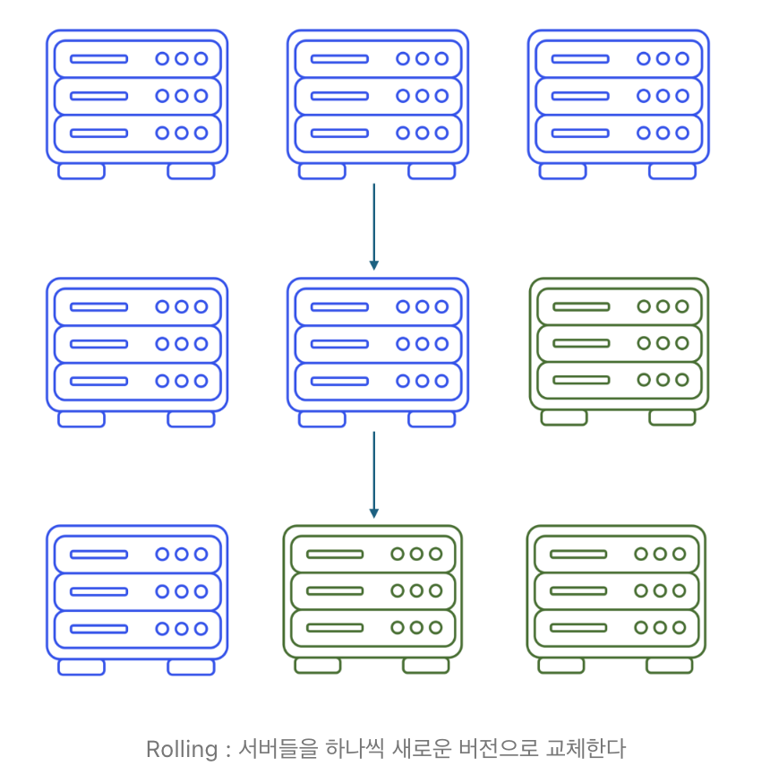
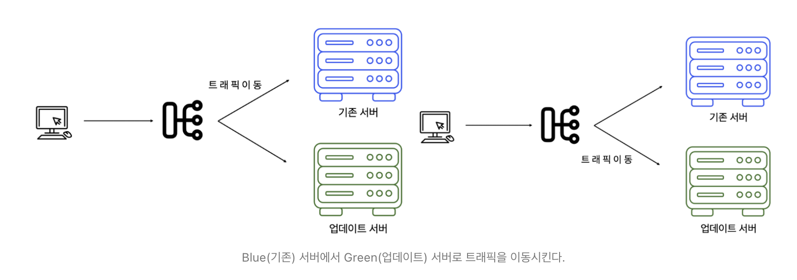
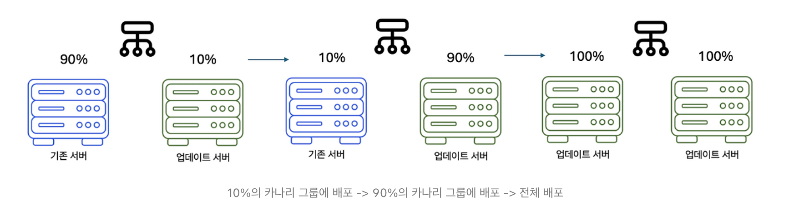
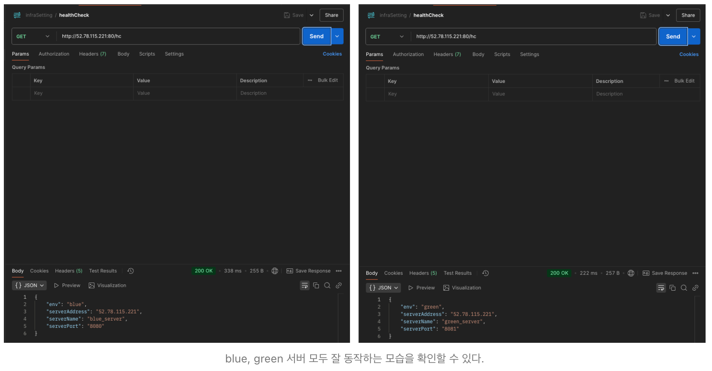

코테이토에서 CI/CD 주제로 발표를 진행하며 여러 가지 배포 전략에도 관심을 갖게 되었다.

## BigBang 배포

먼저 전통적인 Big-Bang Deployment는 가장 단순하지만 효과적인 방법으로, 한 번에 모든 서버를 내리고 업데이트 후 다시 올리는 방식이다. 따라서 성공만 한다면 가장 빠른 배포시간을 가질 수 있다.

하지만 서버를 내리는 과정에서 다운타임이 불가피하게 발생하고, 롤백이 어렵다는 단점이 있다.

전체 시스템을 레거시에서 현대적으로 리디자인하거나 마이그레이션 하는 대규모 업데이트, 혹은 내부 직원이 사용하는 ERP시스템의 경우에 적절한 배포 방식일 수 있지만, 실시간 트래픽이 많은 B2C서비스나 고가용성이 중요한 서비스에서는 적절한 방식이 아닐 수 있다.

따라서 개발자는 상황에 맞는 적절한 배포 전략을 선택해야 한다.

현대적인 무중단 배포 전략들 중, **Rolling, Blue - Green, Canary** 전략에 대해 알아보자.

## Rolling 배포

맨 앞단의 로드밸런서에 연결되어 있는 서버들을 순차적으로 하나씩 새로운 버전으로 변환시키는 방법이다.

추가적인 서버 자원을 사용하지 않기에, 배포가 되는 동안에 교체되지 않는 리소스로 트래픽 부하가 더 걸릴 수 있다는 단점이 존재한다.

그 해결책으로 추가적인 서버를 하나 더 띄워 부하에 영향이 가지 않게 업데이트를 진행할 수도 있다.

하나 중요한 점은, Rolling 배포에서는 점진적 변경으로 인해 기존 버전과 새로운 버전이 동시에 실행될 수 있기에 두 버전 간의 호환성이 매우 중요하다.

순차적으로 시스템을 업데이트하기 때문에, 신규 버전에는 기존 버전에 없는 api가 있거나, 새로운 DB스키마가 등록될 수 있다.

따라서 체계적인 테스트 방식과, 배포 전략이 필요하다.



## Blue - Green 배포

블루 - 그린 배포는 기존 버전과 최신 버전을 동시에 배포하여 운영하는 전략이다.

두 환경이 모두 준비되었을 때, 맨 앞단의 로드 밸런서를 이용해 트래픽을 즉시 전환하여 새로운 버전으로 전달한다.

따라서 다운타임이 없고, 빠른 롤백이 가능하다는 장점이 있다.

그러나 블루, 그린 두 서버가 동시에 켜져 있는 시간이 약간이라도 존재하기에, 추가적인 리소스가 필요하다는 단점이 있다.



## Canary 배포

카나리 배포는 서비스의 일부를 사용자에게 먼저 제공해 새로운 버전의 안정성과 성능을 검증하는 배포 전략이다.

-   제한된 사용자 그룹(카나리그룹)에게 먼저 새로운 버전을 배포한다.
-   카나리 그룹의 피드백과, 서비스의 성능을 모니터링해 새로운 버전의 문제점을 파악한다.
-   문제가 발생한다면, 롤백 후 개선하고, 문제가 없다면 카나리 그룹을 점진적으로 확대한다.
-   이후 모든 사용자에게 서비스를 배포한다.

새로운 버전으로 업데이트하는 과정에서 발생하는 문제점들을 초기에 확인할 수 있어 빠르게 수정하고 개선할 수 있다.  
그러나 다른 무중단 배포 전략에 비해 비용이 많이 발생한다는 단점이 있다.



## Blue - Green 배포 구축

구축하는 방법은 복잡하지 않고, 크게 두 가지 과정으로 나누어 진행했다.

1.  develop 브랜치를 향한 'pull request' 혹은 'merge' (push)가 발생할 때 빌드
2.  'merge' (push) 라면 빌드가 진행된 후 ec2 인스턴스에 배포

blue와 green의 결정은 리버스 프록시의 역할을 담당하는 nginx가 결정하도록 했다.

따라서 클라이언트는 ec2인스턴스트의 IP에 nginx포트인 80번으로 접속하면 아무런 지연 없이 서비스를 사용할 수 있다.

배포자동화를 위해 작성한 코드들은 아래와 같다.

프로젝트 root디렉토리 / .github / workflows / CICD.yml파일 ▼

```
name: CICD

# 빌드가 발생하는 트리거
on:
  push:
    branches: [ "develop" ]
  pull_request:
    branches: [ "develop" ]

permissions:
  contents: read

# 빌드 시작
jobs:
  build:
    runs-on: ubuntu-latest
    steps:
      - uses: actions/checkout@v3
      - name: Set up JDK 21
        uses: actions/setup-java@v3
        with:
          java-version: '21'
          distribution: 'temurin'

      - name: Build with Gradle
        run: |
          chmod 777 ./gradlew
          ./gradlew build -x test

# DockerHub 로그인
      - name: Login to DockerHub
        uses: docker/login-action@v1
        with:
          username: ${{ secrets.DOCKERHUB_USERNAME }}
          password: ${{ secrets.DOCKERHUB_TOKEN }}

# Docker Image 생성
      - name: Build Docker
        run: docker build --platform linux/amd64 -t ${{ secrets.DOCKERHUB_USERNAME }}/live_server .

# Image를 DockerHub에 Push
	  - name: Push Docker
        run: docker push ${{ secrets.DOCKERHUB_USERNAME }}/live_server:latest

# 배포 시작
  deploy:
    if: github.event_name == 'push'
    needs: build
    runs-on: ubuntu-latest
    steps:
    
# nginx upstream 브랜치에 따른 IP, Port 설정 
      - name: Set target IP
        run: |
        
          # http://${{ secrets.LIVE_SERVER_IP }}/env는 서버의 상태 (blue, green) 을 보여주는 url
          STATUS=$(curl -o /dev/null -w "%{http_code}" "http://${{ secrets.LIVE_SERVER_IP }}/env")
          echo $STATUS
          if [ $STATUS = 200 ]; then
            CURRENT_UPSTREAM=$(curl -s "http://${{ secrets.LIVE_SERVER_IP }}/env")
          else
            CURRENT_UPSTREAM=green
          fi
          echo CURRENT_UPSTREAM=$CURRENT_UPSTREAM >> $GITHUB_ENV
          if [ $CURRENT_UPSTREAM = blue ]; then
            echo "CURRENT_PORT=8080" >> $GITHUB_ENV
            echo "STOPPED_PORT=8081" >> $GITHUB_ENV
            echo "TARGET_UPSTREAM=green" >> $GITHUB_ENV
          elif [ $CURRENT_UPSTREAM = green ]; then
            echo "CURRENT_PORT=8081" >> $GITHUB_ENV
            echo "STOPPED_PORT=8080" >> $GITHUB_ENV
            echo "TARGET_UPSTREAM=blue" >> $GITHUB_ENV
          else
            echo "error"
            exit 1
          fi

# 환경변수들을 담는 .env파일 생성 
      - name: Create .env file
        run: |
          echo "DB_URL=${{ secrets.DB_URL }}" >> .env
          echo "DB_USERNAME=${{ secrets.DB_USERNAME }}" >> .env
          echo "DB_PASSWORD=${{ secrets.DB_PASSWORD }}" >> .env

# .env 파일을 ec2인스턴스로 복제
      - name: Copy .env to server
        uses: appleboy/scp-action@master
        with:
          host: ${{ secrets.LIVE_SERVER_IP }}
          username: ubuntu
          key: ${{ secrets.EC2_SSH_KEY }}
          source: .env
          target: /home/ubuntu

# DOcker compose를 통해 서버 컨테이너 띄움
      - name: Docker compose
        uses: appleboy/ssh-action@master
        with:
          username: ubuntu
          host: ${{ secrets.LIVE_SERVER_IP }}
          key: ${{ secrets.EC2_SSH_KEY }}
          script_stop: true
          script: |
            sudo docker pull ${{ secrets.DOCKERHUB_USERNAME }}/live_server:latest
            sudo docker-compose -f docker-compose-${{env.TARGET_UPSTREAM}}.yml up -d

# 기존에 열려있는 서버 상태 확인
      - name: Check deploy server URL
        uses: jtalk/url-health-check-action@v3
        with:
          url: http://${{ secrets.LIVE_SERVER_IP }}:${{env.STOPPED_PORT}}/env
          max-attempts: 5
          retry-delay: 10s

# nginx에서 upstream 브랜치 변경
      - name: Change nginx upstream
        uses: appleboy/ssh-action@master
        with:
          username: ubuntu
          host: ${{ secrets.LIVE_SERVER_IP }}
          key: ${{ secrets.EC2_SSH_KEY }}
          script: |
            sudo docker exec -i nginxserver bash -c 'echo "set \$service_url ${{ env.TARGET_UPSTREAM }};" > /etc/nginx/conf.d/service-env.inc && nginx -s reload' 

# 기존 서버를 담고 있는 컨테이너 내리고 삭제
      - name: Stop current server
        uses: appleboy/ssh-action@master
        with:
          username: ubuntu
          host: ${{ secrets.LIVE_SERVER_IP }}
          key: ${{ secrets.EC2_SSH_KEY }}
          script_stop: true
          script: |
            sudo docker stop ${{env.CURRENT_UPSTREAM}}
            sudo docker rm ${{env.CURRENT_UPSTREAM}}
```

applicaton.yml 파일▼

```
spring:
  profiles:
    active: local
    group:
      local: local, common, secret
      blue: blue, common, secret
      green: green, common, secret

server:
  env: blue

---
// 로컬 환경일때
spring:
  config:
    activate:
      on-profile: local

server:
  port: 8080
  serverAddress: localhost

serverName: local_server

---
// 서버의 env(상태)가 blue일때
spring:
  config:
    activate:
      on-profile: blue

server:
  port: 8080
  serverAddress: 52.78.115.221

serverName: blue_server

---
// 서버의 env(상태)가 green일때
spring:
  config:
    activate:
      on-profile: green

server:
  port: 8081
  serverAddress: 52.78.115.221

serverName: green_server

---

spring:
  config:
    activate:
      on-profile: common
  jpa:
    hibernate:
      ddl-auto:
    show-sql: true
```

