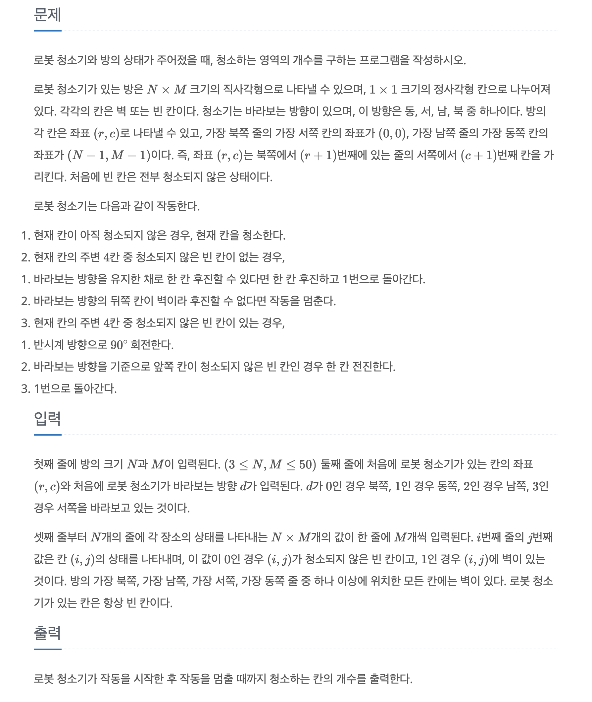

## [Java] 백준 14503 로봇 청소기


## 문제
문제 링크: https://www.acmicpc.net/problem/14503




### 잘못 이해했던 부분

문제 설명엔 다음과 같은 흐름이 나온다

```
1. 현재 칸이 청소되지 않았다면 청소  
2. 현재 칸 주변 4칸 중에 청소되지 않은 칸이 없는 경우:  
1. 후진할 수 있으면 한 칸 후진하고 다시 1번으로  
2. 후진할 수 없으면 작동 종료  
3. 현재 칸 주변 4칸 중에 청소되지 않은 칸이 있는 경우:  
1. 반시계 방향으로 회전  
2. 방금 회전한 방향 기준으로 앞쪽 칸이 청소되지 않았다면 전진  
3. 그렇지 않다면 다시 1번으로 돌아감
```


여기서 **"다시 1번으로"** 가 처음 단계(현재 칸 청소 여부)를 의미한다고 생각했다

그래서 "청소하지 않은 칸이 하나라도 있다면 → 그때부터 회전 시작" 이라는 흐름으로 코드를 짰다

---

### 처음 시도했던 코드
1. 주변 4칸을 먼저 스캔해서 하나라도 청소가 안 된 칸이 존재한다면 dirty = true  

2. dirty == true이면 반시계 회전 1회 → 전진 가능 여부 확인  

**→ 회전은 나중에 하고, 청소 가능한 칸이 있는지 먼저 확인하는 흐름이었다**


하지만 문제의 의도는 **“회전하면서 동시에 확인하라”** 는 것이었다.


한 번 회전할 때마다 그 방향 앞이 청소되지 않았는지 확인하고,
그렇지 않으면 계속 회전하는 방식이다.


정확한 흐름은 이렇다

1. 4번 회전을 반복하며

   1-1. 매번 반시계로 회전하고

   1-2. 그 방향 앞이 청소 가능하다면 전진

2. 네 방향 모두 청소할 수 없다면 처음 방향 기준 후진

3. 후진할 수 없다면 작동 종료


이렇게 구현하려면, 회전 중인 방향(tempDir)과 현재 바라보는 방향(dir)을 분리해서 관리해야 한다


---

### 최종 코드
```java
import java.io.*;
import java.util.*;

public class Main {
static int[][] map;
static boolean[][] visited;
static int N, M;
static int result = 0;

	// 북, 동, 남, 서
	static int[] dr = new int[]{-1, 0, 1, 0};
	static int[] dc = new int[]{0, 1, 0, -1};

	public static void main(String[] args) throws IOException {
		BufferedReader br = new BufferedReader(new InputStreamReader(System.in));
		StringTokenizer st = new StringTokenizer(br.readLine());

		N = Integer.parseInt(st.nextToken());
		M = Integer.parseInt(st.nextToken());

		// 로봇 청소기
		st = new StringTokenizer(br.readLine());
		int nowR = Integer.parseInt(st.nextToken());
		int nowC = Integer.parseInt(st.nextToken());
		int dir = Integer.parseInt(st.nextToken());

		// 방 정보
		visited = new boolean[N][M];
		map = new int[N][M];
		for(int i = 0; i < N; i++) {
			st = new StringTokenizer(br.readLine());
			for(int j = 0; j < M; j++) {
				map[i][j] = Integer.parseInt(st.nextToken());
			}
		}

		DFS(nowR, nowC, dir);
		System.out.println(result);
	}

	static void DFS(int nowR, int nowC, int dir) {
		if(!visited[nowR][nowC]) {
			// 현재 칸 청소
			visited[nowR][nowC] = true;
			result++;
		}


		// 주변 4칸에 청소 안한 칸 있는지 탐색
		int tempDir = dir;
		for(int i = 0; i < 4; i++) {
			// 반시계 방향 회전
			tempDir = (tempDir + 3) % 4;
			int nextR = nowR + dr[tempDir];
			int nextC = nowC + dc[tempDir];

			if(nextR >= 0 && nextR < N && nextC >= 0 && nextC < M) {
				if(!visited[nextR][nextC] && map[nextR][nextC] == 0) {
					DFS(nextR, nextC, tempDir);
					return;
				}
			}
		}

		// 주변 모두 청소된 경우
		// 현재 방향에서 후진
		int nextR = nowR - dr[dir];
		int nextC = nowC - dc[dir];

		if(nextR >= 0 && nextR < N && nextC >= 0 && nextC < M) {
			if(map[nextR][nextC] == 0) {
				DFS(nextR, nextC, dir);
			}
		}

	}
}
```